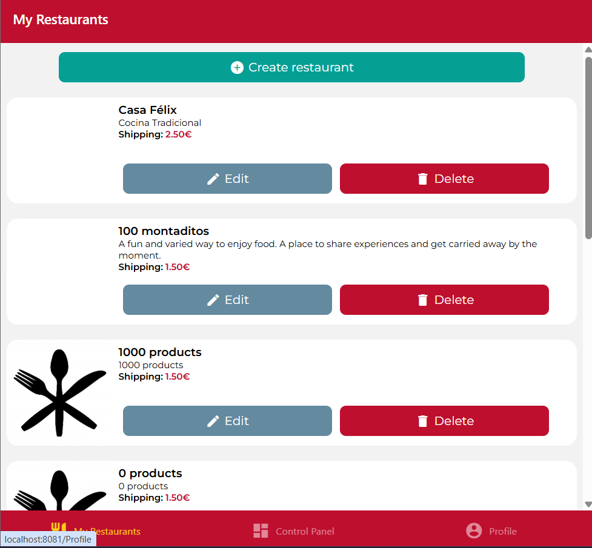
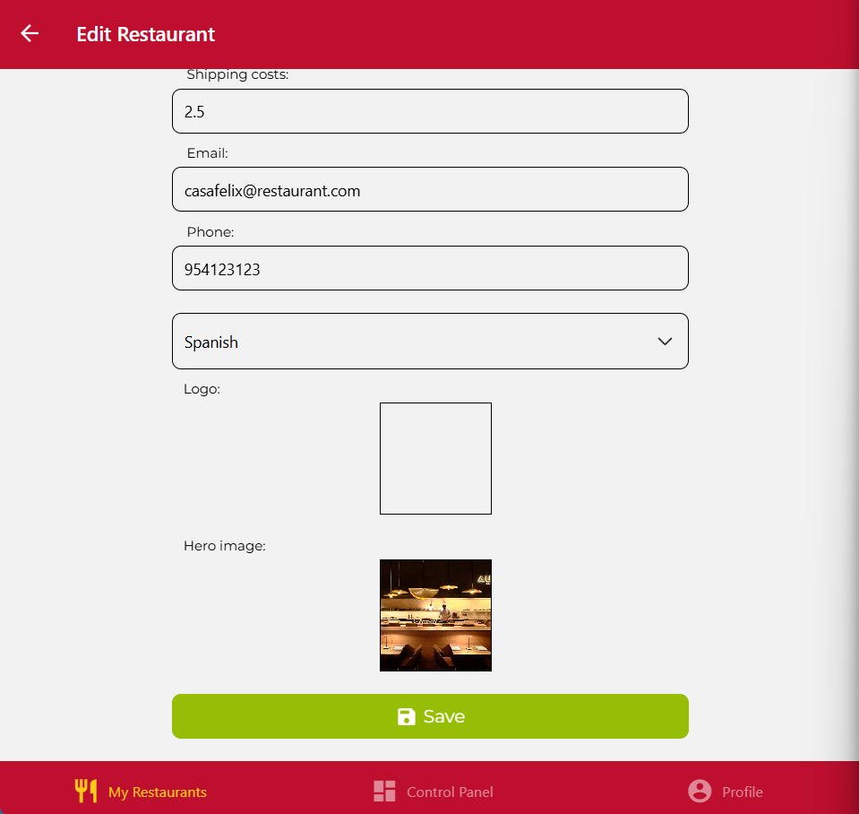
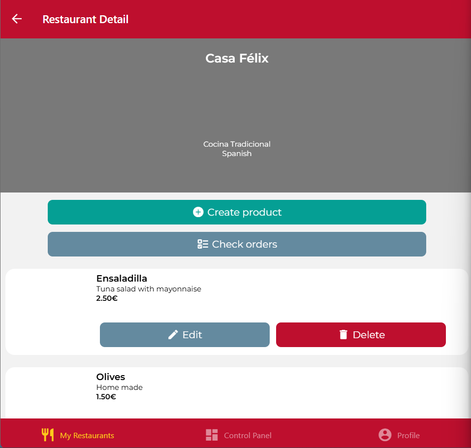
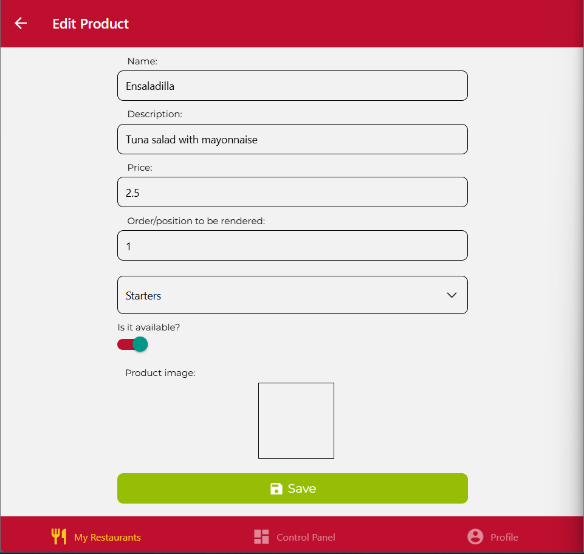
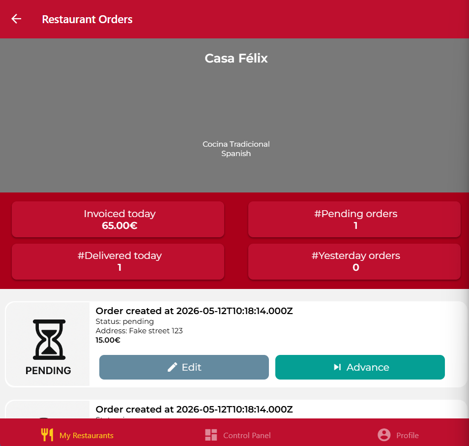
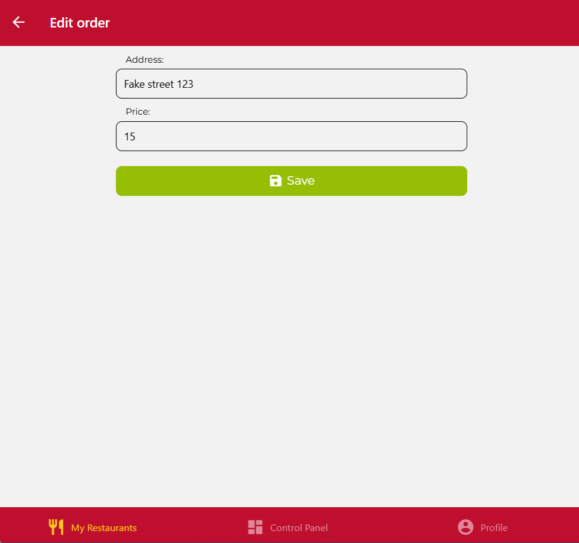

En este proyecto somos OWNER. al SER OWNER, pide estar logado para ver tus restaurantes solo, después ya ya te quedas logado y no se vuelve a poner el isLogged en ningun otro Screen.
Se hace lo siguiente:

-Botones edit y advance

-Al pulsar advence cambia el estado y la imagen

-Mostrar analiticas

-FORMULARIO: editar pedidos

RestaurantsScreen:

RestaurantsScreen -> Pressable Edit -> EditRestaurant FORMULARIO

RestaurantsScreen -> Pressable Restaurant -> RestaurantDetails

RestaurantDetails -> Pressable Edit -> EditProduct  FORMULARIO

RestaurantDetails -> Pressable Check Orders -> OrdersScreen

OrdersScreen -> Pressable Edit -> EditOrder

