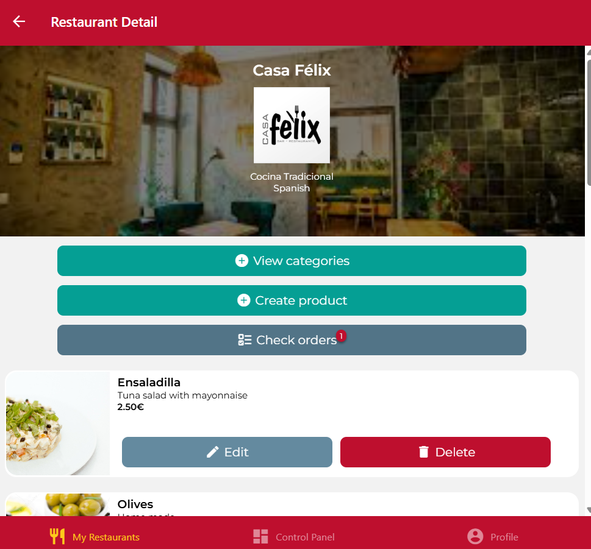
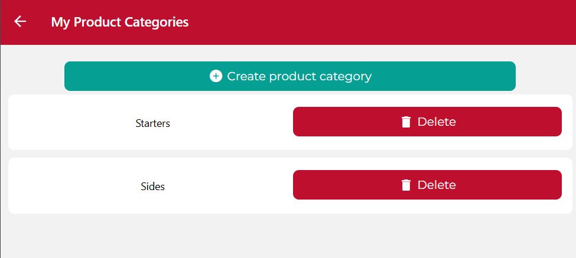
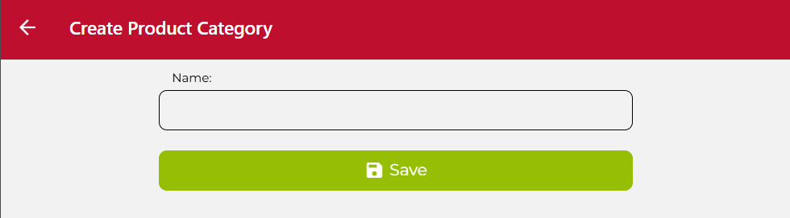
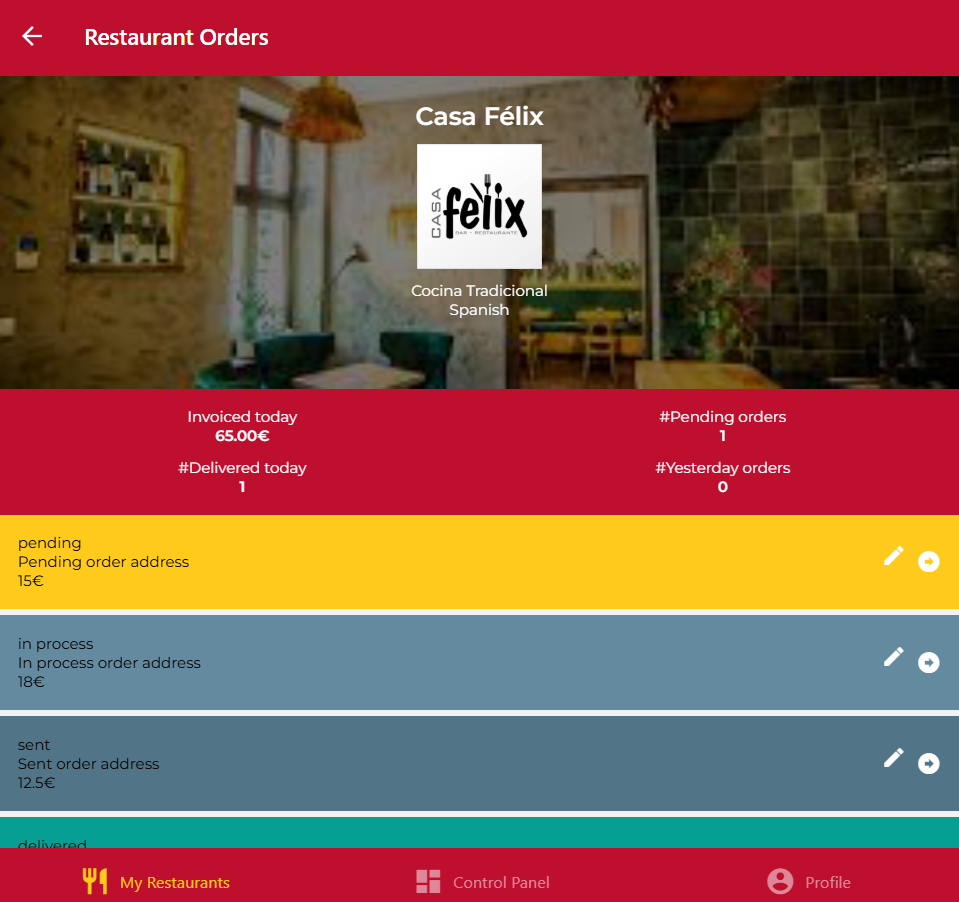

Somos OWNER

RestaurantScreen es normal

Cuando entramos a ver un restaurante en concreto:
RestaurantDetailsScreen:

RestaurantDetailsScreen -> Pressable View Categories -> ProductCategoriesScreen

ProductCategoriesScreen -> Pressable Create Product Categoriy -> CreateProductCategoryScreen.
Save nos devuelve a RestaurantDetail.

RestaurantDetailsScreen -> Pressable Check Orders -> OrdersScreen.
Con la flecha cambia al siguiente estado el pedido y cambia de color. En el lapiz se edita el pedido.
Las estadisticas tienen un estilo diferente.

